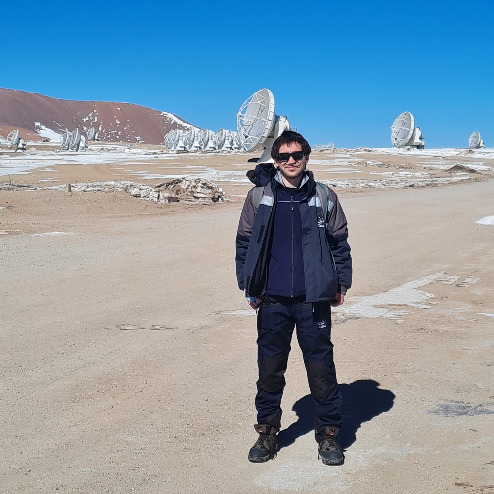

{: style="width: 200px; display: block; margin: 0 auto; text-align: center;" }

Hi 👋 I'm Franco.

I'm an Electronics Engineer from  Chile 🇨🇱. I have worked mostly in radio astronomy 📡. I'm currently working as a Laboratory Manager 👨‍🔬 in the research center [CATA](https://cata.cl). I'm also an emoji expert 😎🔥. 

In my free time I like to play video games 🎮, read about history 📜, and (very slowly) learn the Japanese language 🇯🇵.
